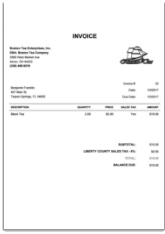
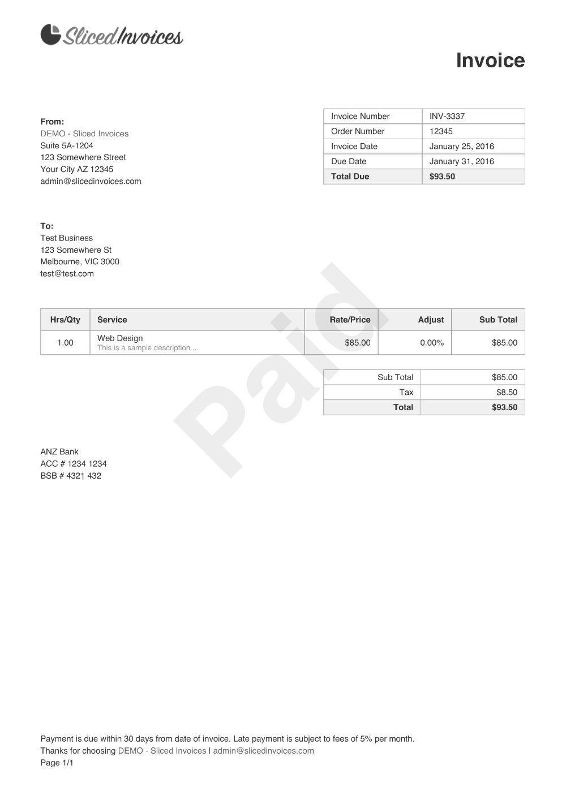
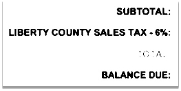
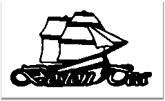
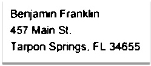
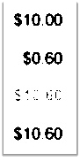
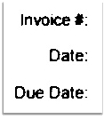
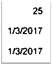

**Documentation for OCR**

1. **Converting Pages to images**
   1. The working of the OCR starts from the execute function which requires the file path and file name of the pdf
      it starts by converting the pdfs into a list PIL images. We the iterate through this list and convert each image from PIL image to NumPy array which OpenCV can accept
   1. Then we call the Image2Text function which takes in this NumPy array as its argument and store the string it return in a variable
   1. This process is repeated for all the pages in the pdf and we concatenate the strings returned from Image2Text function in another string
   1. we save the sting extracted in a .txt file and use the file name as the name of the text file
   1. Finally, the original pdf is deleted from the file path to free the memory

1. **Extracting text from images**
1. **Image preprocessing**

The image received is now preprocessed before text detection to reduce the file size and excess noise in the image

1. First, we turn the image from a 3-channel BGR to a 1-channel Grayscale image to reduce the file size
1. Then we use Gaussian Blur to reduce unwanted noise from the image
1. Canny edge detection is used to get edges (texts and table structure) from the image
1. getStructuringElement and dialate is used to merge nearby contours so that nearby text or table elements can be merged and treated as one rather than separate entities.

This will be used in contour detection

||||
| :-: | :-: | :-: |
|1. Grayscale|2. Blurred|3. Edged|
|

||
|4. kernel|5. dialate|

1. **Contour detection**

Using the findContours function and dialate as our source image, we can detect all the contours in the image where text or table cells are nearby i.e., all the Regions of interest (ROI) in the image

Then we sort these contours in descending order so that the largest contour is the first in the list

Sorting would be necessary in the Text extraction phase

||
| :-: |
|Contours|
1. **Box optimization and Text extraction**
   1. **Box optimization**
      1. Box optimization is required so that our OCR only focuses its resources on regions that have a higher concentration of texts or tables rather than the entire image, this saves resources and improves accuracy and speed  
      1. Using the ROIs from contour detection, we use the coordinates function to get the maximum and minimum x and y coordinates
      1. This will give us the two coordinates required to form a rectangle/Box around the text/table concentrated regions of the image 

||
| :-: |
|Boxes around ROIs|

1. **Text extraction**
   1. Now that we have the rectangular coordinates of our ROI, we can crop that region out of the image so that we only focus on this region of the original image
   1. We use the inRange function to binarize the image, this helps in text detection as it further reduces unwanted noise
   1. The NumPy array is now converted back to a PIL image so that the tesseract’s image to string function can take it as in input
   1. Now we use the image\_to\_string function of tesseract to convert the image into string format

Here we set our parameters as:

- Lang = 'eng'

assuming all the documents will be written in English language

- config='--psm 6 -c tessedit\_char\_blacklist=[]|'

--psm 6 means image will be treated as a single block of text

-c tessedit\_char\_blacklist=[]| removes these specific characters from detection 

We choose these as table cell boxes were often detected as “[] and |”  

1. Now we concatenate all the string detected to the previous string so as to get all the text from different ROIs of the image
1. Finally we remove the rectangular box from the original image so that it won’t be detected again

This is where sorting plays an important role

As the largest contour is removed first, it also removes all the smaller possible contours that might be present there 

This is important because text from all the smaller contours was already detected and extracted in the larger contour, thus not removing them would mean detecting that text once again which would be inefficient and also give us repeated values in the string parsing phase which happens after text detection 

1. The steps in the Box optimization and Text extraction are looped until all the ROIs have been processed
1. We now strip all the unnessary ‘\n’ from the text and return the final string

|itteration|Extracted ROI|Remaining image|
| :-: | :-: | :-: |
|0|

-
||
|1|||
|2|||
|3|||
|4|||
|5|||
|6|||
|7|||
|8|||
|9|||

